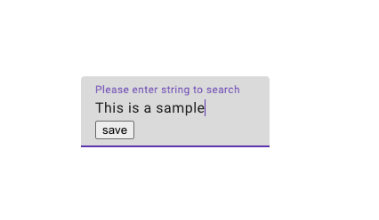
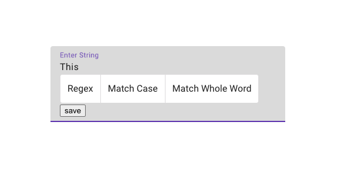
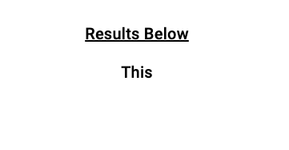

# String Search

This project was generated with [Angular CLI](https://github.com/angular/angular-cli) version 15.0.3.

## Development server

Run `ng serve` for a dev server. Navigate to `http://localhost:4200/`. The application will automatically reload if you change any of the source files.

## Swagger API
First of all, navigate to the "backend" folder. Secondly, open the file titled "alameda-backend.sln" within visual studio. After running the project, a Swagger API service should start up.

## Description

In this program, the user is able to enter a sentence and then search within the sentence that you initially entered.

Enter the sentence that you would like to search on the first page.

After submitting your sentence, you will be navigated to a second page where you can enter what word or words that you would like to search for from the sentence that you submitted on the first page.

Underneath the text entry area, there are modfiers in the form of buttons that will make your search more specific.

After entering your search pattern on the second page, you will be directed to the final page where the results of your query will be displayed

